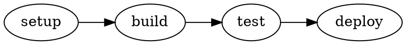

# Bam CLI Reference

Complete command-line interface documentation for bam.

## Installation

```bash
# Using uv (recommended)
uv pip install bam-tool

# Using pip
pip install bam-tool
```

## Overview

bam uses a **flat command interface**. Tasks defined in `bam.yaml` are run
directly as `bam <task>`. Management operations are flags on the same command.

```
bam [OPTIONS] [TASK]
```

Quick reference:

| What you want | Command |
|---|---|
| Run a task | `bam <task>` |
| Watch a task | `bam -w <task>` |
| List tasks | `bam --list` |
| Validate config | `bam --validate` |
| Show dependency graph | `bam --graph` |
| Export DOT graph | `bam --graph-dot` |
| Generate CI pipeline | `bam --ci` |
| Clean cache | `bam --clean` |
| Show version | `bam --version` |

---

## Running Tasks

```bash
bam <task> [OPTIONS]
```

Tasks are resolved from the `tasks:` section of `bam.yaml`. All dependencies
are executed automatically in topological order.

**Options:**

| Flag | Default | Description |
|---|---|---|
| `--jobs N` / `--jobs auto` | `auto` | Number of parallel workers |
| `--dry-run` | `false` | Print execution plan without running |
| `--no-cache` | `false` | Disable cache reads and writes |
| `--quiet`, `-q` | `false` | Suppress command output |
| `--plain` | `false` | Use plain output (no rich UI) |
| `--watch`, `-w` | `false` | Re-run whenever input files change |
| `--debounce FLOAT` | `0.3` | Watch mode: quiet period in seconds before re-running |
| `--config PATH` | auto-discover | Path to `bam.yaml` |

**Examples:**

```bash
# Run a single task
bam build

# Run with explicit parallelism
bam build --jobs 4
bam build --jobs auto   # detect CPU count
bam build --jobs 1      # sequential

# Dry run — show what would run
bam build --dry-run

# Disable caching for this run
bam build --no-cache

# Quiet (only show pass/fail, not command output)
bam build -q

# Force plain output (useful in scripts)
bam build --plain

# Use a different config file
bam build --config path/to/bam.yaml
```

**Behavior:**
- Automatically runs all dependencies in topological order
- Independent tasks run in parallel (controlled by `--jobs`)
- Uses cached outputs when available (unless `--no-cache`)
- Fails fast: the first failed task stops dependent tasks
- Returns exit code 0 on success, 1 on failure

**Interactive Tree View** (TTY only, auto-detected):

```
📦 Tasks
├── ✓ lint               ━━━━━━━━━━━━━━━━━━━━━━━━━━━━━━ 100%
├── ✓ typecheck          ━━━━━━━━━━━━━━━━━━━━━━━━━━━━━━ 100%
│   └── ✓ test           ━━━━━━━━━━━━━━━━━━━━━━━━━━━━━━ 100%
│       └── ✓ build      ━━━━━━━━━━━━━━━━━━━━━━━━━━━━━━ 100%

✓ Successfully executed 4 task(s)
```

**Interactive tasks** (`interactive: true`) are automatically detected and run in
foreground mode after all dependencies finish. The Rich tree view is shown for the
dependency phase; then the terminal is handed directly to the foreground process:

```bash
bam serve
# ✓ install  ━━━━━━━━━━━━━━━━━━━━━━━━━━━━━━ cached
# Starting: serve (interactive)
# Command:  npm run dev
# Press Ctrl-C to stop.
#
#   VITE v5.0.0  ready in 312 ms
#   ➜  Local:   http://localhost:5173/
```

**Error Context:**

```
✗ Task failed: test
  Dependency chain:
    ├─ lint
    ├─ typecheck
    └─ test

⊘ Skipped 1 task(s) due to failure:
  • build
```

---

## Watch Mode

Watch mode re-runs a task (and all its dependencies) whenever any of its **input
files** change. No extra configuration is needed — bam derives the watched paths
directly from each task's `inputs:` patterns.

```bash
bam -w <task>
bam --watch <task>
```

**Options:**

| Flag | Default | Description |
|---|---|---|
| `--watch`, `-w` | `false` | Enable watch mode |
| `--debounce FLOAT` | `0.3` | Quiet period in seconds after the last change before re-running |
| `--jobs N` | `auto` | Parallel workers (passed through to each run) |
| `--no-cache` | `false` | Disable caching for every run |
| `--quiet`, `-q` | `false` | Suppress command output |

**Examples:**

```bash
# Re-run tests whenever source files change
bam -w test

# Watch with explicit parallelism
bam -w test --jobs 4

# Increase debounce — useful for editors that write many files at once
bam -w build --debounce 0.5

# Watch without cache (always run from scratch)
bam -w lint --no-cache
```

**Startup output:**

```
bam watch — test  (Ctrl+C to stop)
  • src
  • tests
  • src  (recursive)

# … initial run shown here …
```

bam prints the directories it is watching at startup, including whether each one is
watched recursively (triggered by `**` glob patterns).

**How watched paths are derived:**

| Input pattern | Watch root | Recursive? |
|---|---|---|
| `src/**/*.py` | `src/` | yes |
| `tests/*.py` | `tests/` | no |
| `pyproject.toml` | `.` (config dir) | no |
| *(any pattern)* | config file directory | no (always) |

The config file itself (`bam.yaml`) is always watched — so editing it takes
effect on the next triggered run.

**Behaviour:**

- An initial run is performed immediately when watch mode starts.
- After each file-system event bam waits for the debounce period, drains any
  further queued events (coalescing rapid saves), then re-runs.
- If `bam.yaml` was edited, the config is reloaded before the next run. A
  config parse error is printed but bam keeps watching — fix the file and save
  to retry.
- Press **Ctrl-C** at any time to exit cleanly.
- All normal flags (`--jobs`, `--no-cache`, `--plain`) pass through to every run.

**Limitations:**

- Watch mode requires at least one `inputs:` pattern on the target task (or its
  dependencies); without declared inputs only `bam.yaml` changes trigger a re-run.
- `--stage` is not supported with `--watch`.
- Tasks with `interactive: true` cannot be the target of `--watch`.

---

## Management Flags

### `--list`

Display all configured tasks and their dependencies.

```bash
bam --list
bam --list --config examples/hello-world/bam.yaml
```

**Output:**
```
Available tasks:
  • build
    depends on: lint, test
  • lint
  • serve [live]
  • test
```

Tasks marked with `[live]` are interactive foreground tasks (see `interactive` in the
configuration reference).

---

### `--validate`

Validate configuration file syntax and dependency graph.

```bash
bam --validate
bam --validate --config path/to/bam.yaml
```

**Checks performed:**
✅ Valid YAML syntax
✅ Required fields present
✅ No cyclic dependencies
✅ All `depends_on` tasks are defined
✅ Runner configuration is valid

**Output:**
```
Configuration is valid: /path/to/bam.yaml
Discovered 8 task(s).
```

---

### `--graph` / `--graph-dot`

Visualize the task dependency graph.

```bash
# ASCII tree (default)
bam --graph

# DOT format for Graphviz
bam --graph-dot > graph.dot
dot -Tpng graph.dot -o graph.png

# With specific config
bam --graph --config path/to/bam.yaml
```

**ASCII Output:**
```
┌─ Roots (no dependencies)
│  ├─ setup-database
│  └─ install-deps
│
├─ Layer 1
│  ├─ lint-python
│  └─ lint-js
│
└─ Layer 2
   └─ test
```

**DOT Output:**


---

### `--clean` / `--clean-force`

Remove cached artifacts from the local cache directory.

```bash
# Prompt for confirmation before cleaning
bam --clean

# Skip confirmation
bam --clean-force

# Custom cache directory
bam --clean-force --cache-dir /path/to/cache
```

| Flag | Description |
|---|---|
| `--clean` | Clean with interactive confirmation prompt |
| `--clean-force` | Clean without confirmation |
| `--cache-dir PATH` | Cache directory (default: `.bam/cache`) |

---

### `--ci` / `--ci-dry-run`

Generate a CI pipeline file from the task graph.

```bash
# Write pipeline file (path determined by provider)
bam --ci

# Preview without writing
bam --ci-dry-run

# Write to a custom path
bam --ci --ci-output .github/workflows/ci.yml
```

Provider is configured in the `ci:` section of `bam.yaml`:

```yaml
ci:
  provider: github-actions   # or gitlab-ci
  runner: ubuntu-latest
  python_version: "3.14"
```

Each bam task becomes one CI job that calls `$BAM_TOOL <task>`, with
job dependencies wired from `depends_on`.

---

### `--version`

```bash
bam --version
```

---

## Interactive (foreground) Tasks

Tasks with `interactive: true` in `bam.yaml` run as long-lived foreground processes.
bam handles them differently from normal tasks:

| Behaviour | Normal task | Interactive task |
|---|---|---|
| stdin / stdout / stderr | captured | **inherited from terminal** |
| Caching | yes | **never cached** |
| Timeout | configurable | none |
| Ctrl-C | kills process group | **forwarded to child** (clean shutdown) |
| Shown in `--list` | `• name` | `• name [live]` |

**Dry-run output** also marks interactive tasks:

```bash
bam serve --dry-run
# Dry-run execution order:
# 1. install
# 2. serve [live]
```

**Rules:**
- An interactive task must be the **last step** — nothing can `depends_on` a server
  that never exits.
- All dependency tasks run with normal caching and the parallel scheduler before the
  foreground process starts.
- SIGINT / SIGTERM exits are treated as clean (exit 0); any other non-zero code is
  reported as a failure.

---

## Global Options

| Option | Description |
|---|---|
| `--config PATH` | Path to `bam.yaml` (default: auto-discover upwards from cwd) |
| `--help` | Show help and exit |
| `--version` | Show version and exit |

---

## Shell Tab Completion

bam supports shell tab completion for task names. Install it once per shell:

```bash
# bash
bam --install-completion bash

# zsh
bam --install-completion zsh

# fish
bam --install-completion fish
```

After installation, `bam <TAB>` completes task names from `bam.yaml`.

---

## Exit Codes

| Code | Meaning |
|---|---|
| `0` | Success |
| `1` | Task failed or configuration error |
| `2` | Invalid CLI usage (bad flag, missing argument) |

---

## Common Patterns

### CI/CD — plain output, no cache

```bash
bam --plain --no-cache ci-checks
```

### Dry run before deploy

```bash
bam deploy --dry-run
```

### Regenerate CI after updating bam.yaml

```bash
bam --ci && git add .gitlab/generated.gitlab-ci.yml && git commit -m "update CI"
```

### Validate before running

```bash
bam --validate && bam build
```

---

## Getting Help

- **Quick help:** `bam --help`
- **Documentation:** https://gitlab.com/cascascade/bam
- **Issues:** https://gitlab.com/cascascade/bam/-/issues
- **Examples:** See `examples/` directory

---

**Version:** 0.5.4  
**License:** MIT
