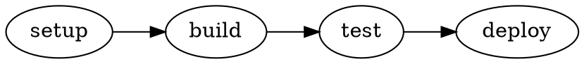

# Cascade CLI Reference

Complete command-line interface documentation for Cascade.

## Installation

```bash
# Using uv (recommended)
uv pip install cascade

# Using pip
pip install cascade
```

## Global Options

All commands support these global options:

- `--help` - Show help message and exit
- `--version` - Show version and exit

## Commands

### `cascade run`

Execute one or more tasks with their dependencies.

**Usage:**
```bash
cascade run [OPTIONS] TASK [TASK...]
```

**Arguments:**
- `TASK` - One or more task names to execute (required)

**Options:**
- `--config PATH` - Path to cascade.yaml configuration file
  - Default: Searches for `cascade.yaml` or `.cascade.yaml` in current directory and parents
- `--dry-run` - Show what would be executed without running anything
- `--quiet, -q` - Suppress command output (only show results)
- `--no-cache` - Disable cache reads and writes for this run

**Examples:**

```bash
# Run single task
cascade run build

# Run multiple tasks
cascade run lint test build

# Dry run to see execution plan
cascade run --dry-run deploy

# Run with specific config
cascade run --config path/to/config.yaml test

# Run without caching
cascade run --no-cache build

# Quiet mode (minimal output)
cascade run -q test
```

**Behavior:**
- Automatically runs all dependencies in topological order
- Uses cached outputs when available (unless `--no-cache`)
- Fails fast on first task error
- Returns exit code 0 on success, 1 on failure

---

### `cascade list`

Display all configured tasks and their dependencies.

**Usage:**
```bash
cascade list [OPTIONS]
```

**Options:**
- `--config PATH` - Path to cascade.yaml configuration file

**Examples:**

```bash
# List all tasks
cascade list

# List with specific config
cascade list --config examples/hello-world/cascade.yaml
```

**Output Format:**
```
Available tasks:
  • build
    depends on: lint, test
  • lint
  • test
```

---

### `cascade graph`

Visualize the task dependency graph.

**Usage:**
```bash
cascade graph [OPTIONS]
```

**Options:**
- `--config PATH` - Path to cascade.yaml configuration file
- `--format FORMAT` - Output format: `ascii` or `dot`
  - Default: `ascii`
  - `ascii` - Tree-style Unicode box drawing
  - `dot` - GraphViz DOT format for rendering

**Examples:**

```bash
# Show ASCII graph
cascade graph

# Generate DOT format for GraphViz
cascade graph --format dot > graph.dot
dot -Tpng graph.dot -o graph.png

# With specific config
cascade graph --config path/to/config.yaml
```

**ASCII Output Example:**
```
┌─ Roots (no dependencies)
│  ├─ setup-database
│  └─ install-deps
│
├─ Layer 1
│  ├─ lint-python
│  └─ lint-js
│
├─ Layer 2
│  ├─ test-unit
│  └─ test-integration
│
└─ Final layer
   └─ deploy
```

**DOT Output Example:**


---

### `cascade validate`

Validate configuration file syntax and dependency graph.

**Usage:**
```bash
cascade validate [OPTIONS]
```

**Options:**
- `--config PATH` - Path to cascade.yaml configuration file

**Examples:**

```bash
# Validate default config
cascade validate

# Validate specific config
cascade validate --config path/to/config.yaml
```

**Checks:**
✅ Valid YAML syntax  
✅ Required fields present  
✅ No cyclic dependencies  
✅ All dependencies defined  
✅ No duplicate task names

**Output:**
```
Configuration is valid: /path/to/cascade.yaml
Discovered 12 task(s).
```

**Error Example:**
```
Error: Cyclic dependency detected in task graph:
  a -> b -> c -> a
```

---

### `cascade clean`

Clean local cache artifacts.

**Usage:**
```bash
cascade clean [OPTIONS]
```

**Options:**
- `--cache-dir PATH` - Cache directory to clean
  - Default: `.cascade/cache`
- `--force, -f` - Skip confirmation prompt

**Examples:**

```bash
# Clean default cache (with confirmation)
cascade clean

# Force clean without confirmation
cascade clean --force

# Clean custom cache directory
cascade clean --cache-dir /path/to/cache
```

**Interactive Mode:**
```
Cache directory: .cascade/cache
Cache size: 142.35 MB
Delete all cached artifacts? [y/N]: 
```

**Force Mode:**
```
✓ Cache cleared
```

---

## Environment Variables

Configure Cascade behavior via environment variables:

| Variable | Description | Default |
|----------|-------------|---------|
| `CASCADE_CONFIG` | Path to configuration file | `./cascade.yaml` |
| `CASCADE_CACHE_DIR` | Local cache directory | `./.cascade/cache` |
| `CASCADE_CACHE_TYPE` | Cache backend type | `local` |
| `CASCADE_LOG_LEVEL` | Logging verbosity | `INFO` |

**Examples:**

```bash
# Use custom config location
export CASCADE_CONFIG=~/.config/cascade.yaml
cascade run build

# Use different cache directory
export CASCADE_CACHE_DIR=/tmp/cascade-cache
cascade run test

# Debug mode
export CASCADE_LOG_LEVEL=DEBUG
cascade run --dry-run deploy
```

---

## Configuration File Discovery

Cascade searches for configuration files in this order:

1. `--config` CLI argument
2. `CASCADE_CONFIG` environment variable
3. `./cascade.yaml` in current directory
4. `./.cascade.yaml` (hidden file) in current directory
5. Walk up directory tree looking for either file

**Example:**

```
/home/user/project/src/
  └─ No config here, searches parent...
/home/user/project/
  └─ cascade.yaml ✓ Found!
```

---

## Exit Codes

| Code | Meaning |
|------|---------|
| 0 | Success |
| 1 | Task failure, configuration error, or validation error |
| 130 | Interrupted (Ctrl+C) |

---

## Tips & Tricks

### 1. Quick Task Status

```bash
# See what will run
cascade run --dry-run build | grep "Would execute"
```

### 2. Cache Debugging

```bash
# Run without cache to force rebuild
cascade run --no-cache build

# Check cache status
cascade clean  # Shows size before confirming
```

### 3. Configuration Validation

```bash
# Always validate after config changes
cascade validate && echo "Config OK" || echo "Config ERROR"
```

### 4. Complex Workflows

```bash
# Run multiple independent targets
cascade run test-frontend test-backend

# Combine with shell scripts
cascade run build && docker build -t myapp .
```

### 5. Visual Debugging

```bash
# Generate dependency graph
cascade graph --format dot | dot -Tsvg > graph.svg
```

### 6. Integration with CI/CD

```bash
# GitLab CI example
script:
  - cascade validate
  - cascade run test
  - cascade run build
  - cascade run deploy

# GitHub Actions example
- name: Run tests
  run: cascade run test
```

---

## Getting Help

For more information:

- **Quick help:** `cascade --help`
- **Command help:** `cascade run --help`
- **Documentation:** https://gitlab.com/cascascade/cascade
- **Issues:** https://gitlab.com/cascascade/cascade/-/issues
- **Examples:** See `examples/` directory

---

**Version:** 0.1.0  
**License:** MIT
